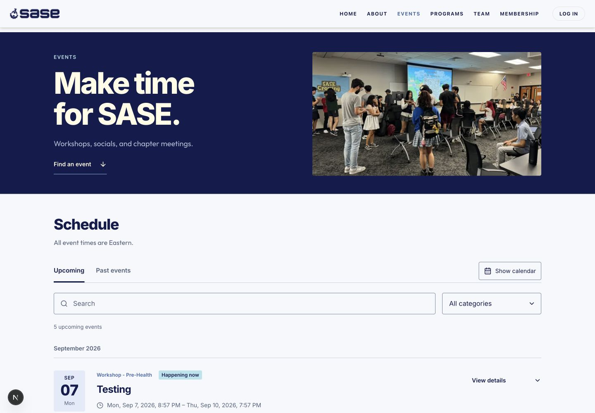
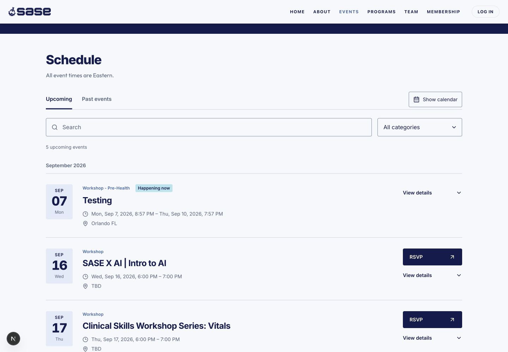
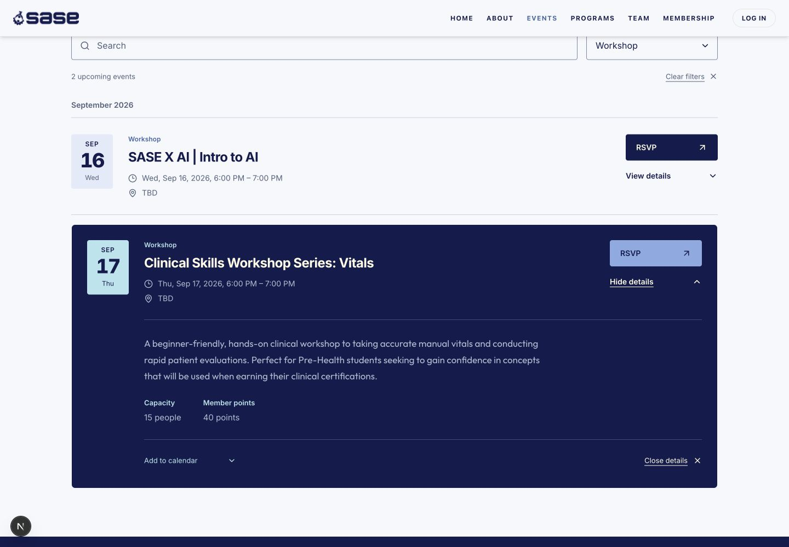
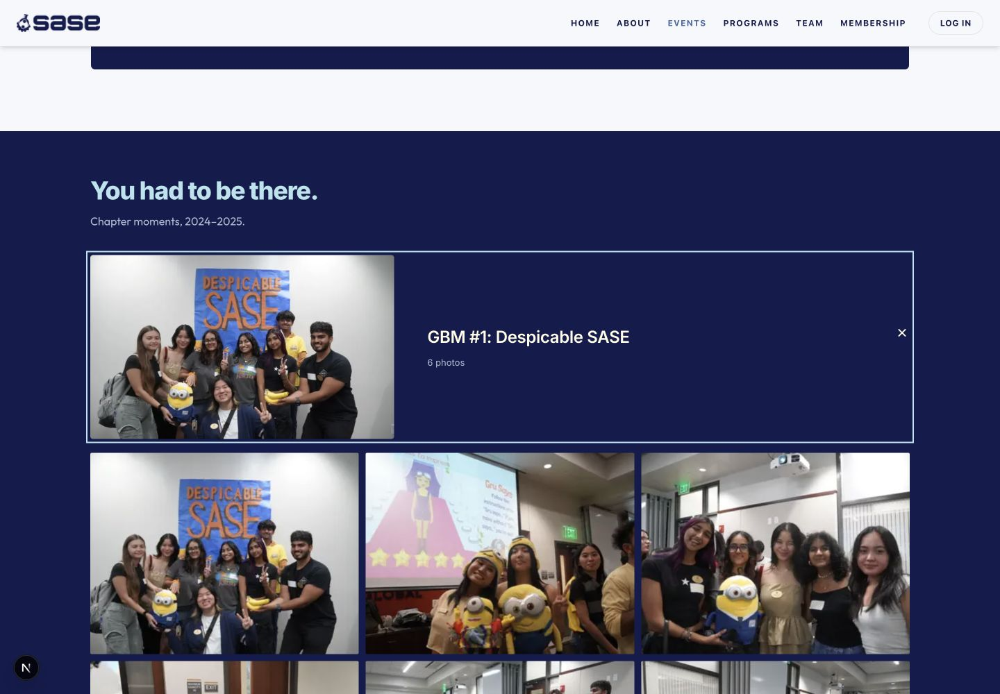
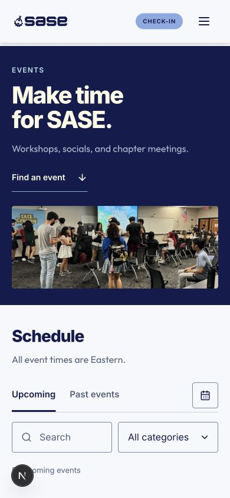
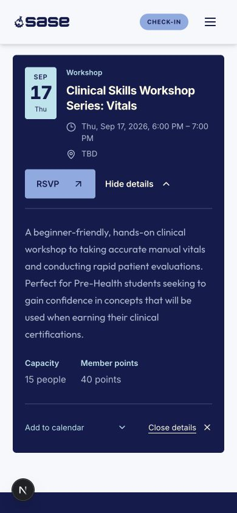
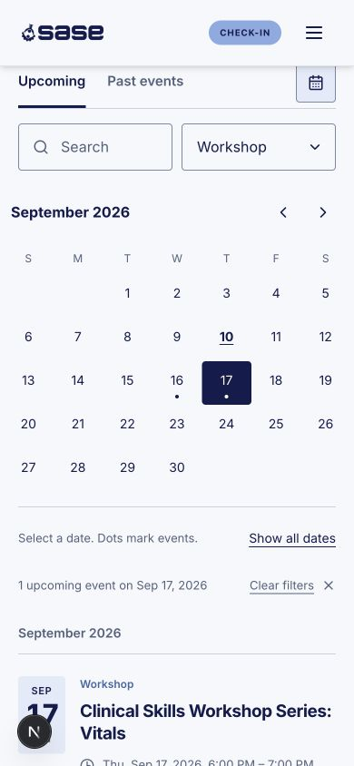

# Events page review

The Events page uses the SASE navy, cream, blue, and aqua palette with existing chapter photography. The schedule is a compact list; View details expands the selected event in place, preserving filters and the current URL.

This work is on `feature/events-page-redesign`, based on `codex/landing-page-polish` while homepage PR #53 is open. The shared navigation, other routes, authentication, database writes, and dependencies are outside this change.

## Product changes

- Short introduction, an anchored schedule, and all 18 existing photos organized into three native album disclosures.
- Upcoming and past events, name search, category filtering, and an optional calendar with date filtering and useful reset controls.
- Collapsed rows prioritize category, title, date/time, location, and attendance actions. Full descriptions, host, capacity, points, calendar exports, and applicable check-in links appear in inline details.
- One explicit details trigger per event, a close action at the end of long content, visible keyboard focus, and focus return after closing.
- Opening and closing ease surrounding rows into place using transforms. Content reveals in stages. Reduced-motion preferences and browsers without Web Animations receive immediate state changes.
- Dates use America/New_York. Ongoing events remain upcoming until they end; multi-day events occupy each active calendar day. Midnight end times do not add an extra day.
- Descriptions omit stored registration metadata. External RSVP targets accept only HTTP(S). Google Calendar and ICS exports retain event timing and clean descriptions.

The existing `/events/[id]` route remains available for shared links. Published-event filtering and 60-second server revalidation remain in place. The error state offers retry and contact actions without displaying backend error details.

## Validation

| Check | Result |
| --- | --- |
| Production build | Passed in an isolated copy of the base plus these seven source/test files. The files matched the working copy byte for byte after the build. |
| Events helper tests | All six passed: Eastern dates, multi-day and midnight boundaries, DST, event status, registration metadata, and calendar exports. |
| Changed-file ESLint | Passed for the Events page, client, calendar, display helpers, motion hook, and tests. |
| Diff whitespace | Passed. |
| Responsive layout | No horizontal overflow at 320, 390, 768, 1023, 1024, and 1440px. Calendar day buttons remain at least 44px wide. See [measurements](responsive-checks.json). |
| Browser interactions | Inline expansion, closing with Enter, focus return, rapid toggle reversal, category persistence, search/empty recovery, calendar selection/reset/month navigation, and album disclosure checked. |
| Standalone type check | Still fails at `tests/admin-membership.test.ts:167`: obsolete `unpaidMembers` access and an implicit-any `id`. This test is unchanged from the parent branch. The same errors reproduce in the isolated copy. |

Reduced-motion handling was inspected in code; device-level motion emulation and physical-device testing were not performed. The production build and standalone type check are separate results, and the build passing does not resolve the membership test error.

## Screenshots

Individual viewport captures from the local development preview on September 10, 2026. Desktop is 1440 × 1000; mobile is 390 × 844. They show existing published records, including the record named “Testing.” Category and date filters are applied in the detail/calendar captures. Screenshots show appearance; the interaction checks above cover motion and behavior.

### Desktop

### Mobile

| Introduction | Inline details | Date filtering |
| --- | --- | --- |
|  |  |  |

## Review focus

1. Open `/events`, filter to a category, and expand an event. Confirm the description and actions appear inline and the category stays selected. Close using the footer button and confirm keyboard focus returns to View details.
2. Exercise Upcoming/Past, empty search results, calendar navigation, and a day containing an event. Check the Eastern date/time against the event record.
3. Inspect a long event description on a narrow screen. Try repeated opening/closing and reduced-motion preferences.
4. Check the existing RSVP destination and calendar export links. Open an album to confirm every photo is still accessible.

The main implementation areas are [the client/disclosures](../../../components/events/events-client.tsx), [date/export helpers](../../../components/events/event-display.ts), and [motion coordination](../../../components/events/use-event-motion.ts). Styling is scoped to [Events](../../../app/events/events.module.css).

No migrations, new environment variables, or new packages are required. Reverting the Events change restores the previous schedule and photo layout.
